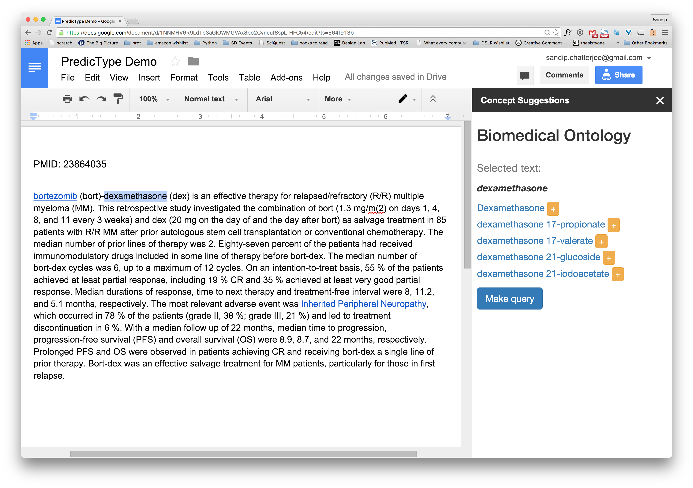

# PredicType: real-time Google Docs concept suggestion plugin

Sandip Chatterjee, Michel Dumontier, Tong Shu Li

2015-11-18 to 2015-11-20

Second BD2K 4th Network of Biothings Hackathon, Stanford University

## Overview

PredicType provides biological concept annotation capabilities from within Google Docs using [BioPortal](http://bioportal.bioontology.org). Originally conceived as a real-time biological auto-complete for biological concepts, PredicType was retooled into an annotation tool due to limitations in the Google Docs API.

[Google Slides Presentation](https://docs.google.com/presentation/d/1BCf42o8SWWvws1f6vnYfIhhNJTHr5Da1myjxar7LjRE/edit?usp=sharing)

